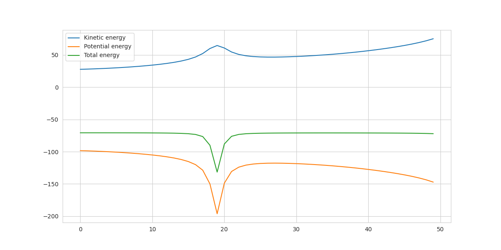

# Toy SE3 transformer
This example illustrates how SE3-transformer works on a really simple dataset.

## Data
I used code: https://github.com/pmocz/nbody-python to generate traces for particles subject to gravitational pull. 
The transformer should predict positions and velocities of particles at step __t+50__ using positions and velocities from step __t__.
To generate this dataset use the script __dataset/generate_dataset.py__

The dynamics looks like:

Energy is appriximatelly conserved:

## Replicating
To generate dataset go to dataset directory and launch:
*python generate_dataset.py -train*
*python generate_dataset.py -test*
It will create two files *data_train.pkl* and *data_test.pkl*.

Then from the root of the repository train for 100 epochs with:
*python main.py -train*
Afterwards testing can be launched:
*python main.py -test*

## Results
The results one should get after 100 epochs:
phase | Loss (abs)
------| ---------
Train | 0.063
Test  | 0.037
