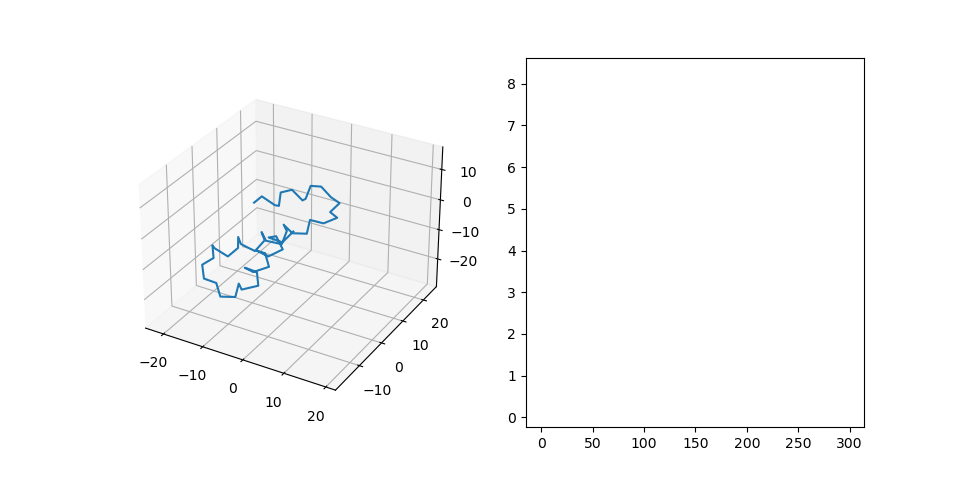
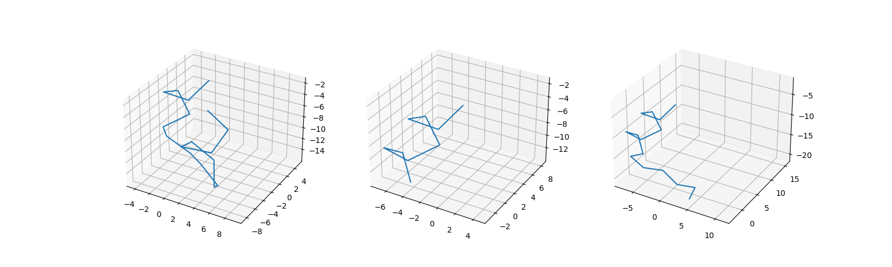

# Toy protein transformer
This example illustrates how to iteratively learn proein structures from sequences.

## Data
I generated the dataset using the following procedure:
1. Generate a sequence consisting of blocks, each block is assigned to either pattern (alpha helix/beta sheet) or flexible fragments (grey). Additionally in the beginning of each pattern the amino-acid encodes the position of this block relative to the previous one(yellow):

2. Place the patterns according to the sequence:

3. Fit the full protein into the placed patterns, while keeping them rigid and fragments flexible. It looks like this (left: protein CA; right: RMSD):

Finally examples from the dataset look like:

To generate the data you need to create directories *dataset/train*, *dataset/test*. 

Then run the script *spatial_dataset.py -name train -size 100* to generate training set with 100 examples. 

The script *spatial_dataset.py -name test -size 30* will generate test set with 30 examples.

## Training and testing
The script *main.py* is responsible for launching training and testing.

## Results
The results on a small dataset (100 train, 30 test):
epoch | Train | Test
------| ----- | -----
0     | 6.56  | 6.54
100   | 1.37  | 1.42
